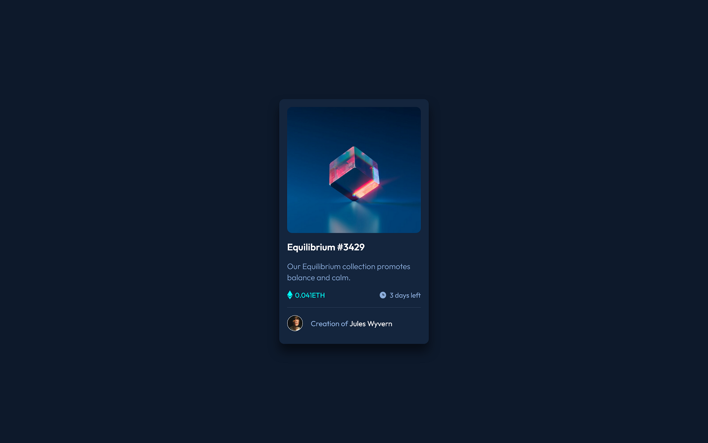

Welcome! 👋

Frontend Mentor - NFT preview card component solution

This is a solution to the [NFT preview card component challenge on Frontend Mentor](https://www.frontendmentor.io/challenges/nft-preview-card-component-SbdUL_w0U). Frontend Mentor challenges help you improve your coding skills by building realistic projects. 

#Table of contents

- Overview
  - The challenge
  - Screenshot
  - Links
- My process
  - Built with
- Author

Overview

The challenge

Users should be able to:

- View the optimal layout depending on their device's screen size
- See hover states for interactive elements

Screenshot

- Solution URL: https://github.com/Lapupeh/nft-preview-card.git
- Live Site URL: https://creative-klepon-017230.netlify.app/

Built with

- Semantic HTML5 markup
- CSS custom properties
- Flexbox
- CSS Grid
- Mobile-first workflow

Author
 Olabimpe Abesin
- Frontend Mentor - [@Lapupeh](https://www.frontendmentor.io/profile/Lapupeh)

